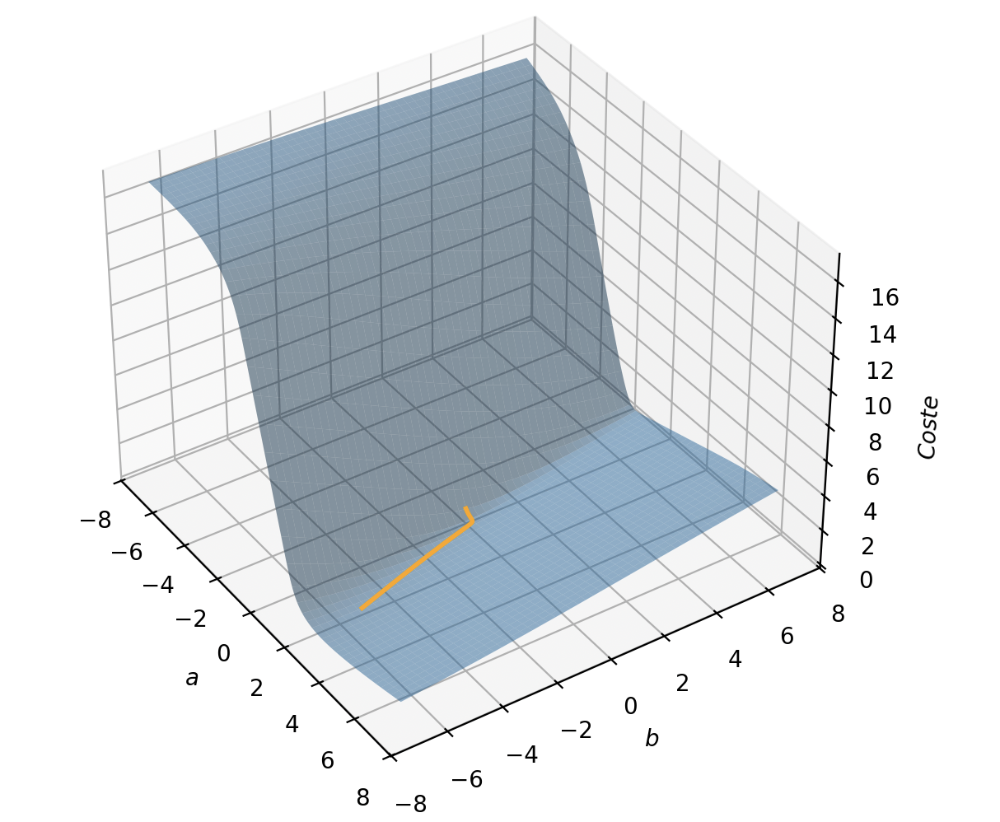
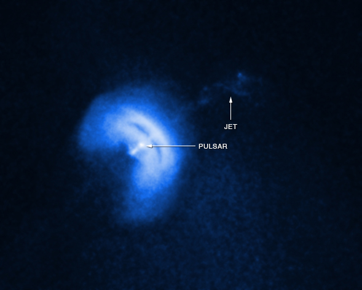
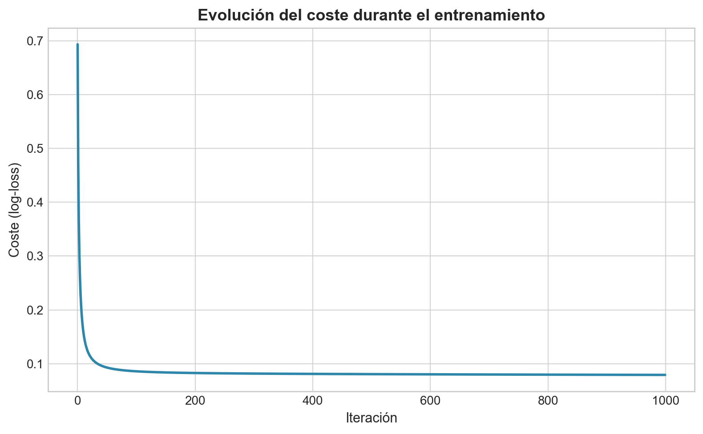

# ml-quest

Comienzo de Machine Learning. Cuaderno para aprender.

## Descenso de Gradiente 

[Implementación en el repo de Métodos numéricos](https://github.com/joslfer/metodos-numericos#descenso-de-gradiente)

## Regresión Logística

Implementación desde cero de la regresión logística (predecir aprobado/suspenso según las horas de estudio). 

Se emplea la función sigmoide, log-loss y el descenso de gradiente.

[`regresion-logistica/regresion_logistica.ipynb`](regresion-logistica/regresion_logistica.ipynb)

# Clasificación de púslars

Entrenamiento de un modelo de regresión logística **desde 0** para clasificar si una una señal de un radiotelescopio es un púlsar o no.

🌌 Un pulsar es una estrella de neutrones que gira muy rápido en el universo emitiendo pulsos. Los datos son de HTRU2 (high time resolution universe)

No se ha utilizado 'scikit-learn' para entrenar el modelo. Se implementa todo manualmente.

## Contenido

- Carga y exploración del dataset
- Train/test split.
- Estandarización de las variables.
- Implementación vectorizada de la regresión logística.
- Entrenamiento con descenso por gradiente.
- Evaluación con la matriz de confusión, accuracy, precision, recall y F1-score.

## Resultados

- Accuracy: **97.91 %**
- Precision: **93.75 %**
- Recall: **82.57 %**
- F1-score: **87.80 %**

## Cuaderno .ipynb
[`pulsars_htru2/train_model.ipynb`](pulsars_htru2/train_model.ipynb)
...

